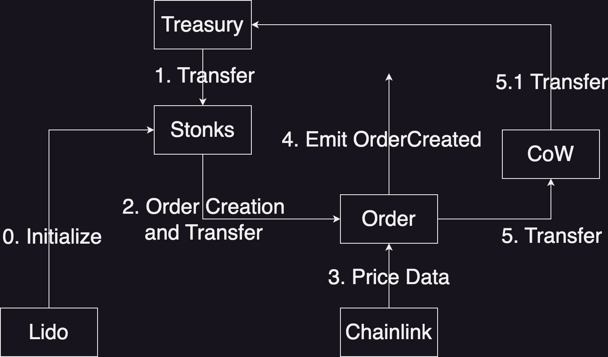

# Uncover Hidden Bugs with Fuzzing Workshop

Brought to you with ❤️ by [Ackee Blockchain Security](https://ackeeblockchain.com) and authored by [Andrey Babushkin](https://x.com/CyberBabushkin).

If you have any questions or need help, feel free to reach out at any time!


## Workshop Description

This workshop is designed to introduce you to the world of fuzzing. For this workshop, we will be learning the use case of the Stonks protocol by Lido, where using a fuzz test written by Ackee Blockchain helped uncover a medium-severity bug in the code. The original fuzz test can be found [here](https://github.com/Ackee-Blockchain/tests-lido-stonks).

For the workshop, you will need:

1. A basic understanding of smart contracts and Solidity;
2. A laptop with [VSCode](https://code.visualstudio.com/) and [Python](https://www.python.org/downloads/) installed;
3. Good mood and a desire to learn!

## Lido Stonks

Stonks is a set of smart contracts that allows the Lido treasury to swap the stETH token for stablecoins and back. The protocol is designed to be fully decentralized and governed by the Lido DAO. The full proposal with a detailed description of the Stonks rationale can be found [here](https://research.lido.fi/t/lido-stonks-treasury-swaps-via-optimistic-governance/6860). Here, we extract the workflow of the original Stonks protocol:

1. The Stonks protocol acts as a receiver of tokens and a container of swap operations set by Lido DAO. For each swap pair, a separate Stonks instance is deployed.
2. Tokens are transferred from the DAO Treasury to the Stonks instance.
3. Stonks deploys a new Order contract via `placeOrder` function and it automatically sends all available assets there.
4. After deployment, the Order emits an event about its creation, sets an allowance to the CoW vault relayer contract and waits until this order is completed. At this step, the Order contract uses the price data from the Chainlink oracle to calculate the amount of target tokens.
5. An off-chain component listens for the event and executes the swap on the CoW contract.



For this workshop, we simplify things a little (but like really a little). We do not care about the CoW protocol, and we do not care about the Chainlink oracle. The oracle is replaced by a Market contract that returns the fixed price for all pairs with some random noise. Otherwise, the protocol and the code remain the same.


## Workshop Agenda

1. Clone this repository:

    ```bash
    git clone --recurse-submodules git@github.com:Ackee-Blockchain/workshop-ethereumzurich-fuzzing.git
    cd workshop-ethereumzurich-fuzzing
    ```

2. Open the `workshop-ethereumzurich-fuzzing` folder in VSCode.
3. In VSCode, install the [Tools for Solidity (Wake)](https://marketplace.visualstudio.com/items?itemName=AckeeBlockchain.tools-for-solidity) extension.
4. Explore the `contracts` folder to understand the Stonks protocol.
5. Explore a fuzz test for the Stonks protocol written for use with Foundry in `tests/Foundry.t.sol`.
6. Create `pytypes` for the Stonks protocol using the `Wake` framework:

    ```bash
    wake init pytypes
    ```

7. Open the `tests/test_fuzz.py` file and rewrite the fuzz test to use the `Wake` framework.
8. Run the fuzz test with:

    ```bash
    wake test
    ```

9. Analyze the results and understand the bug that causes the test to fail.
10. Fix the bug in the Stonks protocol.
11. Run the fuzz test again to ensure the bug is fixed.
12. Celebrate your success!
13. Share your experience with the workshop on social media and tag us [@AckeeBlockchain](https://x.com/AckeeBlockchain) and [@CyberBabushkin](https://x.com/CyberBabushkin).
14. Enjoy the rest of the conference!
